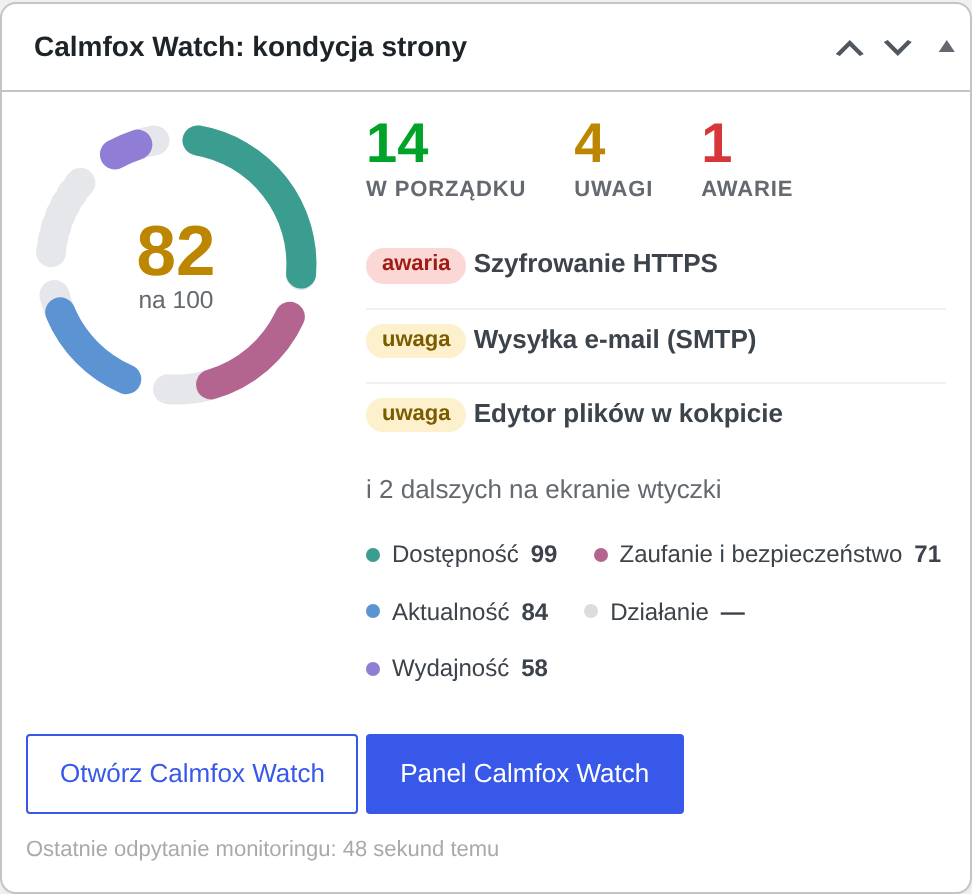
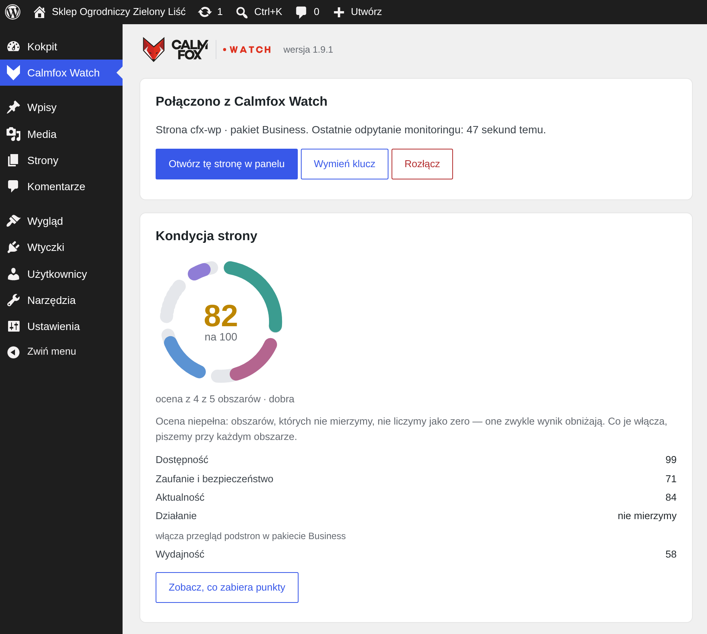
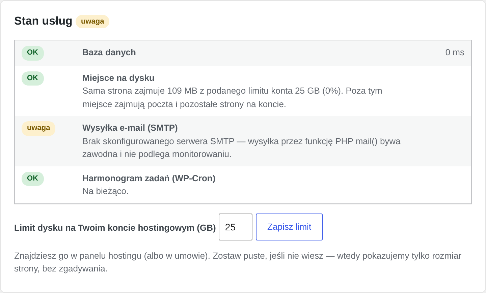
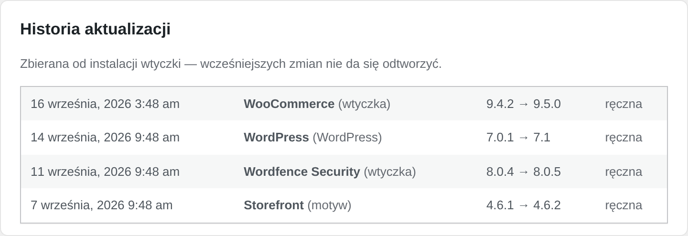

# Calmfox Watch dla WordPressa

[English](README.md) · **Polski**

Monitoring wnętrza WordPressa dla [Calmfox Watch](https://watch.calmfox.net):
zdrowie usług, podstawowa higiena bezpieczeństwa i historia aktualizacji.

Wtyczka wystawia jeden sekretny adres kontrolny, który odpytuje monitoring Calmfox
Watch. Model jest „pull": wtyczka nie wysyła nic z siebie poza rejestracją,
parowaniem i rozłączeniem. Reszta to odpowiedzi na pytania monitoringu.

## Zrzuty ekranu



*Kafelek z kondycją strony na pulpicie kokpitu: pierścień oceny, liczniki sprawdzeń i najpilniejsze sprawy.*



*Ekran wtyczki: stan połączenia i ocena kondycji strony w podziale na obszary.*



*Stan usług, z limitem dysku konta hostingowego podanym ręcznie.*



*Historia aktualizacji: każda aktualizacja WordPressa, wtyczek i motywów z wersją przed i po.*

## Wymagania

| Składnik | Zakres |
| --- | --- |
| WordPress | 6.0 i wyżej (testowane do 7.0) |
| PHP | 7.4 i wyżej |
| Multisite | obsługiwany |

## Co robi

- **Zdrowie usług**: baza danych, miejsce na dysku, połączenie z serwerem poczty
  (SMTP), harmonogram WP-Cron, cache obiektowy (Redis/Memcached), Elasticsearch
  (ElasticPress). Wyniki publikuje sekretny adres odpytywany przez monitoring;
  awaria usługi otwiera incydent w panelu Calmfox Watch.
- **Higiena bezpieczeństwa**: proste, uczciwe sprawdzenia konfiguracji (sole,
  edytor plików, XML-RPC, uprawnienia plików, wersja PHP, zaległe aktualizacje).
  Sprawdzenie, które zapala się na czerwono, mówi też, co ma być zamiast tego,
  a tam, gdzie naprawa mieści się w jednym poleceniu, pokazuje je gotowe do
  skopiowania. To NIE jest audyt bezpieczeństwa ani skaner złośliwego kodu.
- **Naprawy jednym kliknięciem**: uprawnienia `wp-config.php` i katalogów
  zapisywalnych dla wszystkich, wyłączenie XML-RPC i edytora plików w kokpicie.
  Każda naprawa jest opisana przed kliknięciem, a wyłączenia są odwracalne.
  Polecenia pokazywane jako podpowiedzi niczego nie uruchamiają same.
- **Historia aktualizacji**: każda aktualizacja WordPressa, wtyczek i motywów
  z wersją przed i po, zbierana od instalacji wtyczki. W panelu spina się z osią
  incydentów („co się zmieniło przed awarią").
- **Kafelek na pulpicie**: status, liczniki sprawdzeń i najwyżej trzy najpilniejsze
  sprawy, dla osoby, która weszła do kokpitu po czymś innym i właśnie mija awarię.
- **Konto Free od ręki**: aktywacja wprost z wtyczki, logowanie linkiem z e-maila,
  bez hasła.

## Instalacja

1. Wgraj i aktywuj wtyczkę.
2. Wejdź w **Calmfox Watch** w menu kokpitu (pozycja z ikoną, zaraz pod „Kokpitem").
3. Połącz stronę jedną z trzech dróg:
   - **Połącz przez watch.calmfox.net**: jeden przycisk. Logujesz się (albo
     rejestrujesz) w panelu, wybierasz organizację i wracasz do kokpitu ze sparowaną
     wtyczką. Strona nie musi wcześniej istnieć w panelu.
   - **Pakiet Free**: podajesz adres e-mail, konto powstaje od razu.
   - **Token instalacji**: wklejasz token z ekranu Integracje w panelu. To droga
     awaryjna, gdy przekierowanie nie wchodzi w grę.

## Adres kontrolny

Wtyczka rejestruje trasę REST `calmfox/v1/health`. To monitoring nas odpytuje, a nie
odwrotnie, więc nie ma sesji, którą mógłby się wykazać: autoryzacją jest sekret
w parametrze `key`, porównywany funkcją `hash_equals`, a bez niego adres odpowiada
403. Awaria usługi przełącza odpowiedź na HTTP 503. Parametr `section=security`
wybiera sekcję bezpieczeństwa, o którą monitoring pyta raz na dobę; o zdrowie usług
pyta co minutę.

Każda odpowiedź jest podpisana: przy każdym odpytaniu panel wysyła jednorazowy
znacznik, a wtyczka podpisuje nim odpowiedź kluczem instalacji (HMAC-SHA256
w nagłówku). Dzięki temu widać, czy wynik powstał naprawdę teraz na tej stronie, czy
ktoś podstawił pod ten adres statyczny plik albo powtarza starą kopię. Odpowiedź bez
ważnego podpisu nie nadpisuje stanu strony i otwiera zdarzenie w panelu.

Wymiana sekretu (przycisk „Wymień klucz") działa z oknem 15 minut: nowy sekret
obowiązuje od razu, poprzedni jest honorowany jeszcze kwadrans, więc nieudane
przepięcie w panelu nie zrywa monitoringu.

## Własne sprawdzenia

Usługi, o których wie tylko deweloper strony (RabbitMQ, kolejki, inne demony),
dokłada się filtrem `calmfox_watch_health_checks`:

```php
add_filter('calmfox_watch_health_checks', function (array $checks) {
    $ok = @fsockopen('127.0.0.1', 5672, $errno, $error, 2);
    $checks[] = array(
        'id'     => 'rabbitmq',
        'status' => $ok ? 'ok' : 'fail',
        'label'  => 'RabbitMQ',
        'detail' => $ok ? null : 'Broker nie przyjmuje połączeń.',
    );
    if ($ok) {
        fclose($ok);
    }
    return $checks;
});
```

Statusy to `ok`, `warn` i `fail`. Trzymaj krótki, twardy limit czasu: adres kontrolny
odpowiada co minutę i nie może zamulić strony.

## Multisite

Sieć multisite jest obsługiwana: każda podstrona łączy się z panelem osobno (własny
sekret, własny adres, własna strona w panelu), a liczba kont z pełnymi uprawnieniami
obejmuje też super-adminów sieci, bo mają dostęp do wszystkich podstron. Historia
aktualizacji jest wspólna dla sieci, tak jak wspólne są wtyczki i motywy. Zalecamy
aktywację sieciową: przy aktywacji tylko na wybranej podstronie historia zapisze
wyłącznie te aktualizacje, które akurat poszły w jej kontekście. Rozmiar instalacji
na multisite dotyczy całej sieci i tak jest opisany.

## Prywatność

Wtyczka wysyła do Calmfox wyłącznie: domenę strony, podany adres e-mail (przy
aktywacji konta) oraz dane diagnostyczne opisane wyżej (statusy usług, wersje, liczby
zaległych aktualizacji, historię aktualizacji, nazwy aktywnych wtyczek i stan
automatycznych aktualizacji). Nazwy aktywnych wtyczek są potrzebne po to, żeby panel
mógł napisać, która wtyczka została wyłączona, zamiast ogólnego „coś się zmieniło".
Loginów administratorów nie wysyłamy: panel dostaje ich liczbę i jednokierunkowy
odcisk zbioru kont, po którym widać zmianę składu, ale nie da się odczytać, kto to
jest. Żadnych treści, użytkowników ani haseł.

## Ograniczenia

- Test SMTP sprawdza połączenie z serwerem poczty, nie faktyczne doręczenie.
- Miejsce na dysku: hosting współdzielony nie ujawnia limitu konta (PHP raportuje
  cały wolumen serwera), więc podajesz go w ustawieniach wtyczki. Bez niego wtyczka
  pokazuje tylko rozmiar instalacji, bez zgadywania.
- Historia aktualizacji zaczyna się od instalacji wtyczki. Wcześniejszych zmian nie
  da się odtworzyć.

## Licencja

GPL-2.0-or-later, zobacz [LICENSE](LICENSE).
